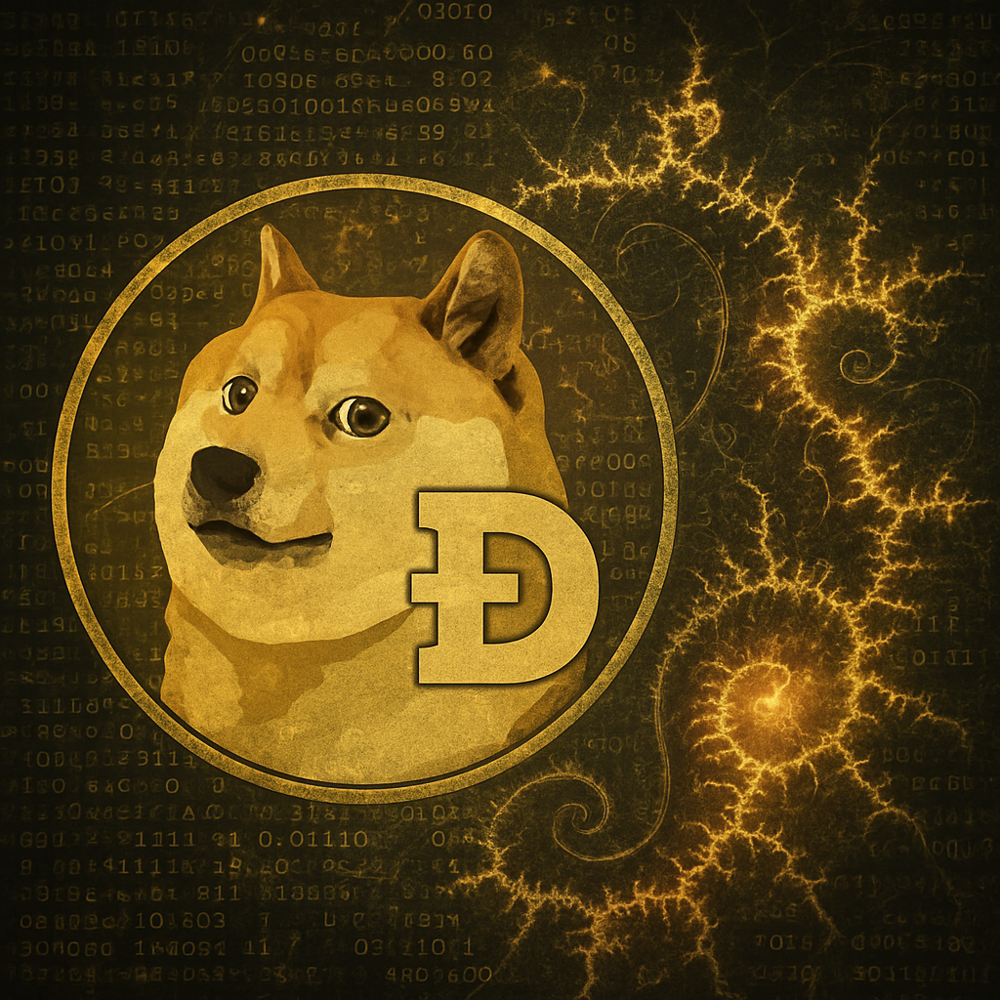
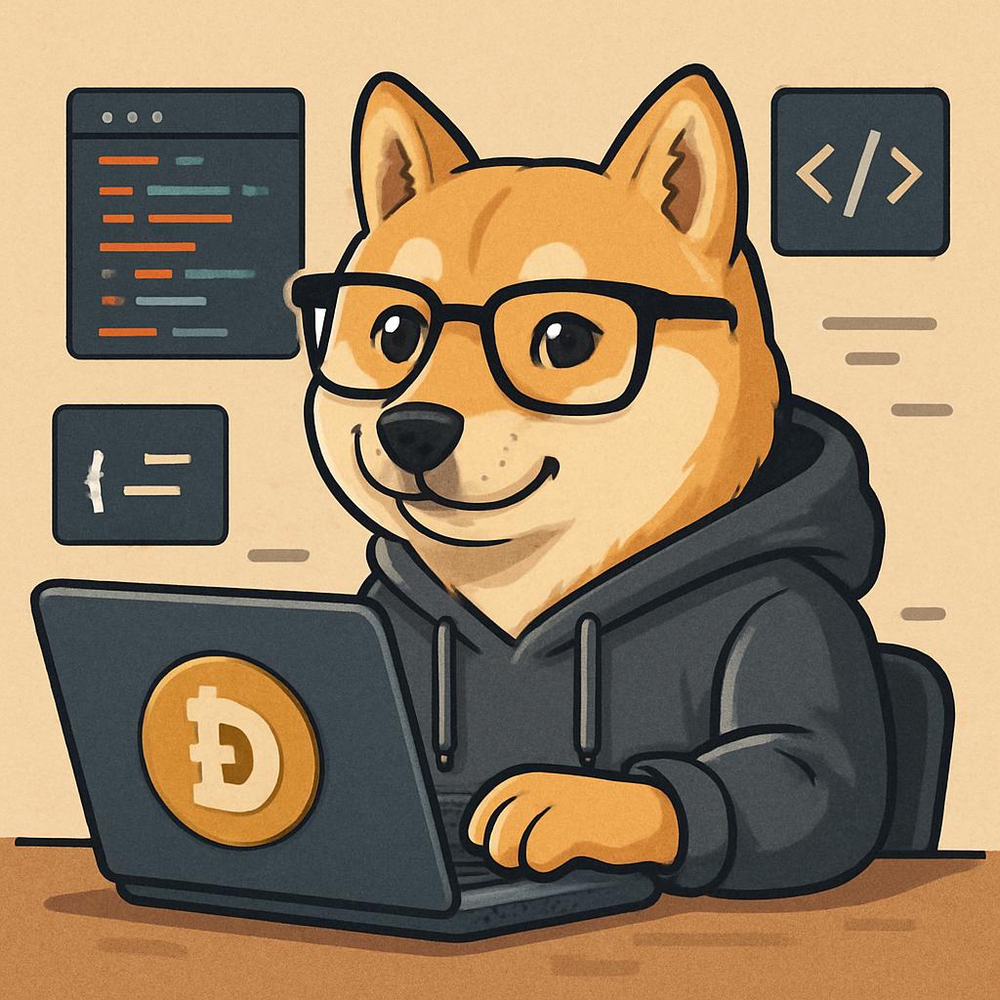

<!-- METADATA
title: Dogecoin Core
description: The Dogecoin Core software allows anyone to operate a node in the Dogecoin blockchain networks
-->

## Dogecoin Core

The Dogecoin Core software allows anyone to operate a node in the Dogecoin blockchain networks.

 {{small-image}}

{{image-caption}}
The mathematical beauty of Dogecoin's decentralized network
{{/image-caption}}

### Key Features

- **Full Node Implementation**: Complete validation of all transactions and blocks
- **Wallet Functionality**: Built-in wallet for managing your Dogecoin
- **Mining Support**: Full support for mining operations
- **Network Security**: Helps secure the network through consensus participation

### Technical Overview

Dogecoin Core is based on Bitcoin Core with modifications specific to Dogecoin's unique features:

- Faster block time (1 minute vs Bitcoin's 10 minutes)
- Different hashing algorithm (Scrypt vs SHA-256)
- No hard supply cap
- Lower transaction fees

### Getting Started

To run Dogecoin Core:

1. Download the latest release from GitHub
2. Verify the signatures
3. Install and sync with the network
4. Start using your wallet or contributing to network security

### Development

The project is actively maintained by a dedicated team of developers. Contributions are welcome through:

- Bug reports and feature requests
- Code contributions via pull requests
- Testing and documentation improvements
- Community support and education

{{two-column}}

 {{square-image}}

{{image-caption}}
Unleash the power of the Dogecoin fractal engine! 🚀 Dive into the infinite possibilities of crypto creativity!
{{/image-caption}}

{{column-divider}}

#### Much Paragraph

Lorem ipsum dolor sit amet consectetur. Duis dictum velit velit adipiscing in interdum. Dictum sit ultrices imperdiet hendrerit elementum. Nibh velit eget egestas neque tellus facilibus duis nibh et. Id nunc ac ipsum in sodales pharetra. Pellentesque leo gravida imperdiet donec risus egestas.

```javascript
function test() {
  console.log("notice the blank line before this function?");
}
```

{{/two-column}}

### System Requirements

- **Operating System**: Windows, macOS, Linux
- **RAM**: Minimum 1GB, recommended 2GB+
- **Storage**: 50GB+ for full blockchain
- **Network**: Broadband internet connection

### Community

Join the development discussion:
- GitHub: Issues and pull requests
- Reddit: r/dogecoindev
- Discord: Dogecoin Developers channel

Together, we're building the future of Dogecoin!